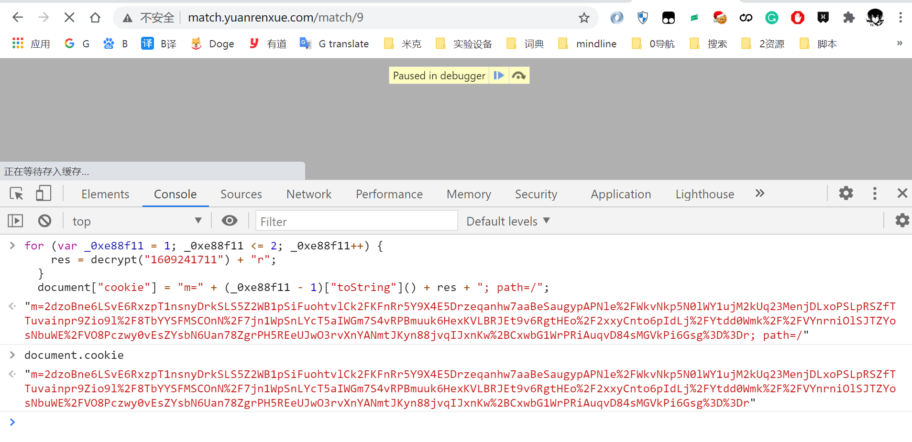
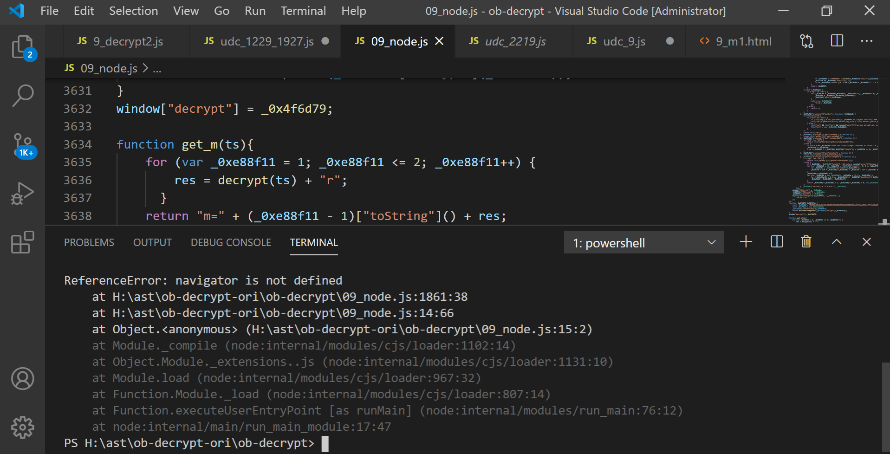
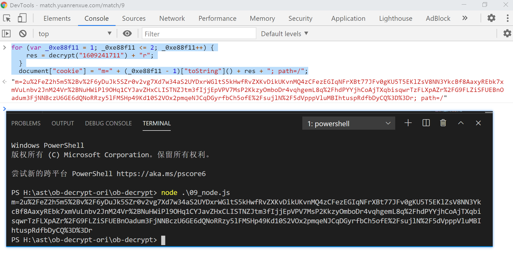

# 猿人学第九题
**题目地址**  
```
http://match.yuanrenxue.com/match/9
```
## 需要的工具或代码准备
### ob-decrypt
利用AST(抽象语法树)对JavaScript代码进行部分还原提高代码可读性的开源仓库
```
https://github.com/DingZaiHub/ob-decrypt
```
我fork之后改了一个小bug已经提了pull request暂未被merge，针对本题可直接使用一下的代码。
```
https://github.com/skygongque/ob-decrypt
```
猿人学网站提供的ob解混淆工具  
```
http://tool.yuanrenxue.com/decode_obfuscator
```
网站提供的ob解混淆工具的通用性很高且还原程度很高，但针对本题改变了部分逻辑而且不易发现。  
### reres
> ReRes可以用来更改页面请求响应的内容。通过指定规则，您可以把请求映射到其他的url，也可以映射到本机的文件或者目录。ReRes支持单个url映射，也支持目录映射。  
谷歌应用商店下载  
```
https://chrome.google.com/webstore/detail/reres/gieocpkbblidnocefjakldecahgeeica?hl=en
```
github 地址  
```
https://github.com/annnhan/ReRes
```

## 浏览器调试
刚按F12进行调试就被给了一个下马威，是一个udc.js的文件是一个无限debugger拉到最后发现是一个1万多行的文件。


把udc.js文件保存下来，使用ob-decrypt工具进行还原，[还原后的udc.js文件](./pic/09js/9_udc_decrypt.js)通过reres映射回去。  

**此时可以重新请求测试一下，发现仍然可以拿到数据。**    

使用charles或者fiddler抓一下完整的包发现第一次请求`http://match.yuanrenxue.com/match/9`是一段代码还原后[/match/9还原后](./pic/09js/9_decrypt.js)  
其中有一段代码明显是设置cookie的  


但是发现设置cookie时调用的函数decrypt并没有在这个js文件中定义，但是这个文件引用了我们之前还原过的文件udc.js。
在9_udc_decrypt.js这个文件搜索果然找到了decrypt的定义。


然后我们可以设一个断点在decrypt的定义之后调用  
```
for (var _0xe88f11 = 1; _0xe88f11 <= 2; _0xe88f11++) {
    res = decrypt("1609241711") + "r";
  }
  document["cookie"] = "m=" + (_0xe88f11 - 1)["toString"]() + res + "; path=/";
```



发现可以正常的设置cookie。  
此时后面可以注释掉window["decrypt"] = _0x4f6d79;后面的代码重复上面的操作发现仍然可以正常设置cookie说明之后的代码都是无用的代码在扣js的时候应该去掉。  
这个时候我们总体的逻辑就清楚了，在udc.js中定义decrypt在第一次访问主页的时候后调用上面这段代码设置cookie然后带这个设置好的cookie在访问接口就可以拿到数据了。  

## node.js中调试
[还原后的udc.js文件](./pic/09js/9_udc_decrypt.js)将window["decrypt"] = _0x4f6d79后面的代码去掉剩下的在nodejs中调试。
调试的时候注意try...catch的代码以及对window和global操作的代码。因为我们已经可以在浏览器动态调试，所以可以跟浏览器中对于位置的执行结果进行比较。  
最后总结出来的几个在node.js运行需要改动的地方。 
发现浏览器这个if判断是有值的，所以应该什么都不执行。 
  
补充navigator 和 并把window指向global  

最终node环境和浏览器环境的结果相同。  


其他细节第一次请求`http://match.yuanrenxue.com/match/9`设置cookie中的时间戳是动态的并且加密的次数也不同，时间戳可以用正则表达取一下，加密多少次没有跟sessionid绑定而是以加密结果的第一位传给服务器，所以可以固定加密次数。  

## 完整代码
[完整代码](../../match-yuanrenxue/match09)  

## 成功留念
